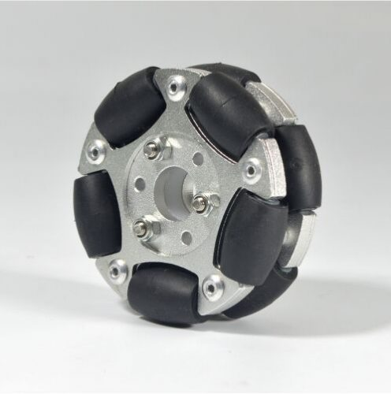

# Omni Wheel Hub for Servos

This servo wheel hub is designed for [60mm aluminum omni wheel](https://www.robotshop.com/en/60mm-aluminum-omni-wheel.html) which are designed for a 3kg load capacity. They currently support:

- [AX-12A servos](http://emanual.robotis.com/docs/en/dxl/ax/ax-12a/) you can get from Robotis.us
    - use 4 M2x6 screws to attach hub to servo
    - use 1 M3x12 self-tapping screw to attach hub cap to servo hub
- [LX-16A servos](http://www.lewansoul.com/product/detail-17.html) you can get from amazon.com
    - use 4 self-tapping servo hub screws to attach hub to servo
    - use 1 M3x12 self-tapping screw to attach hub cap to servo hub
